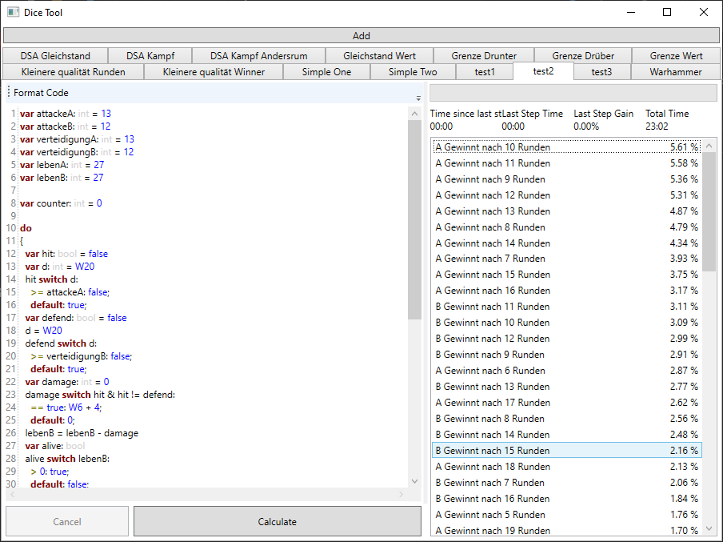

[](https://www.nuget.org/packages/DiceTool/)
[](https://github.com/LokiMidgard/Dice-Tool/actions?query=workflow%3A%22Test+Build%22)
[](https://tldrlegal.com/license/mit-license#summary)

# Dice-Tool

This Project tries to help you finding out what the probability's are when you
role multiple dice.

While this is easy for a few dice it can get complicated if you chain multiple
roles together and change the dices used depending on the previous results.

This Project consists of
 - A Library you can include in your own program via
   [](https://www.nuget.org/packages/DiceTool/)
 - A Domain Specific Language called `Dice Language` to write down what your
   intend is. (A parser is also available on [](https://www.nuget.org/packages/DiceTool.Parser/))
 - A Windows Desktop Application that will give you the results (You can
   download it under
   [Releases](https://github.com/LokiMidgard/Dice-Tool/releases/latest))
 
 You can read [how it works](docs/how-it-works.md) in the docs.

 # The Dice Language

 It is a simple language but should allow you to formulate your Intent.

 A simple Program for example looks like following

 ```
var rolle1: int = D6
var result: int
if rolle1 > 4
  result = D3
else
  result = D12
return result
 ```

 Every Script must end with an `return`. Variables need to be declared before
 used using the `var` keyword and with a colon (`:`) after the identifier
 followed by the type. After that you can assign values using equals (`=`). For
 more information see the [docs](docs/dice-language.md).

 An Example with exploding dices
 ```
 var role: int
 var sum: int = 0
 do {
   role = D6
   sum = sum + role
 } while role == 6
 return role
 ```

 You find more samples in the [docs](docs/samples)

# Windows Application

There is a Windows Desktop application that allows "fast" testing. You can add
multiple dice programs and it will save the results if they where already
calculated.



You can write the code on the left side and the results will appear on the
right. There you also find a progress bar that shows the overall progress. It
shows how much of the probability space you have already visited.

But be aware that this is not an linear search. The first results found will
have a much higher probability to occur then the later ones. So the progress
will slow down.

The tool will also not search the completed probability space since like with
exploding dices there will be an infinite number of results. It will stop if it
has found more then 99.99% of the probability space.

# Library

The Library creates a syntax tree by concatenating method calls on an `Composer`
class.

To get such an `Composer` you can call
```c#
Calculator<T>.Configure(composer=>{});
```

The with this method generated program will accept an input

The type parameter `T` defines the type of this input. 

Generally this library can handle 3 types. `string`, `int` and `bool`.

In the `Configure` callback you can chain your statements that will describe how
the dice should be rolled.

Every value has the type `P<T>` again `T` may be any supported type. Every time
you role a dice or set a constant you get a `P<T>` that allows you to reference
this exact value.

```c#
// This will create a dice and stores its value in the c# variable dice
var dice = composer.Dice(6);
// This will create a constant and stores its value in @const
var @const = composer.Const(5);
```
Also every expression will be stored in such an `P<T>`.
```c#
var result = dice.GreaterOrEqual(@const);
```

You can also create variables that can hold a `P<T>`. Those variables can be
changed.
```c#
composer.AssignName("NAME", dice);
```

To access the current content of a variable call `GetNamed`. Besides its name
you also need to supply the type of the variable

```c#
var variable = composer.GetNamed<T>("NAME")
```

A complete program looks like this:
```c#
var executor = Calculator<int>.Configure(composer =>
    {
        var dice = composer.Dice(6);
        var @const = composer.Const(5);
        var result = dice.GreaterOrEqual(@const);
        return result;
    });
```
the return in the callback holds the result. This will role a 6 sided dice and
test if it is 5 or 6.

To run the program call `Calculate` on the `executor`.
```c#
var results = executor.Calculate();
```

The executor has a property `Epsilon`. This is useful for programs that will
have an infinite sample space. E.g. with exploding dices. The epsilon is the size
(in percent 1 equals 100%) of the sample space that may be missing from the
results.


You can also use loops. All loops are do-while loops.
```c#
composer.DoWhile(() =>
{
    // some operations
    return // this will be the condition of the while and must be a `P<bool>`
});
```

The API should be written discoverable. But you can also look in the sample
project for more information.


# Parser

The parse does not have ~~many~~ any options. But at least that makes it easier
to document ;)

To pares dice language code you need to call following method:
```c#
string code; // some dice language code.
var executer = Dice.Parser.SimpleParser.ParseExpression<T>(code);
var results = executor.Calculate();
```
Where `T` is the expected return time. Supported are `int`, `bool` and `string`.
Calculate can have a parameter, but the dice language does not yet support input
parameters.

Results is an async enumerator that will contain the results.

