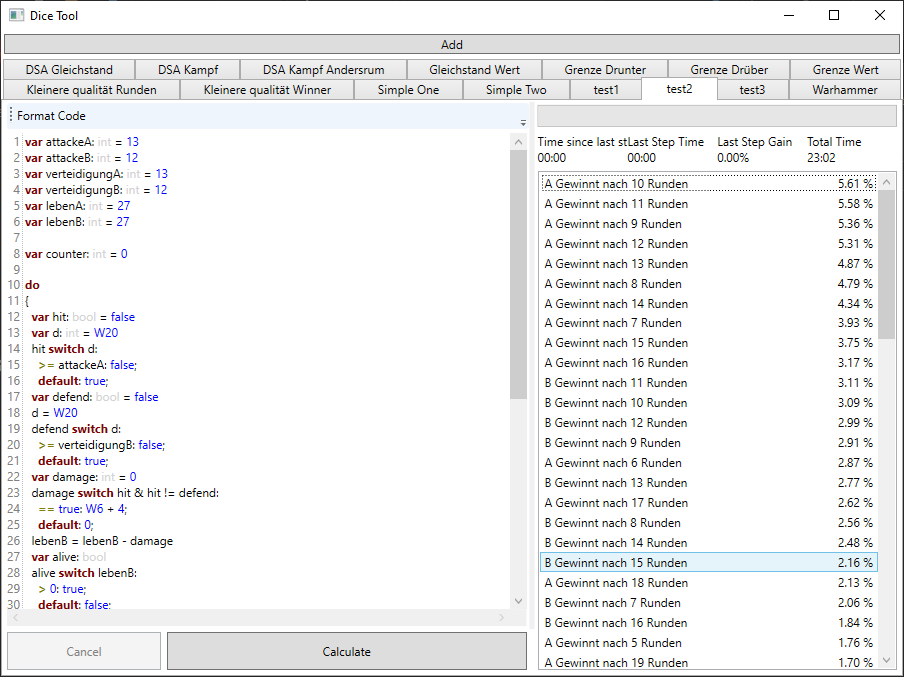

[](https://www.nuget.org/packages/DiceTool/)
[](https://github.com/LokiMidgard/Dice-Tool/actions?query=workflow%3A%22Test+Build%22)
[](https://tldrlegal.com/license/mit-license#summary)

# Dice-Tool

This Project tries to help you finding out what the propabilitys are when you rolle multiple dice.

While this is easy for a few dice it can get complicated if you chain multiple roles together and change the dices used depending on the previous results.

This Project consists of
 - A Library you can include in your own program via [nuget](https://www.nuget.org/packages/DiceTool/)
 - A Domain Specific Language called `Dice Language` to write down what your intend is
 - A Windows Desktop Application that will give you the results (You can download it under [Releases](https://github.com/LokiMidgard/Dice-Tool/releases/latest))
 
 You can read [how it wokrs](docs/how-it-works.md) in the docs.

 # The Dice Language

 It is a simple langunage but should allow you to formulate your Intent.

 A simple Programm for example looks loke following 

 ```
var rolle1: int = D6
var result: int
if rolle1 > 4
  result = D3
else
  result = D12
return result
 ```

 Every Script must end with an `return`. Variables need to be declared before used using the `var` keyword and with a collon (`:`) after the identifier followed by the type.
 After that you can assign values using equals (`=`). For more information see the [docs](docs/dice-language.md).

 An Example with axploding dices
 ```
 var role: int
 var sum: int = 0
 do {
   role = D6
   sum = sum + role
 } while role == 6
 return role
 ```

 You find more samples in the [docs](docs/samples)

# Windows Application

There is a Windows Desktop application that allows "fast" testing. You can add
multiple dice programs and it will save the results if they where already
calculated.



You can write the code on the left side and the results will appear on the
right. There you also find a progress bar that shows the overall progress. It
shows how much of the probability space you have already visited.

But be aware that this is not an linear search. The first results found will
have a much higher probability to occur then the later ones. So the progress
will slow down.

The tool will also not search the completed probability space since like with
exploding dices there will be an infinite number of results. It will stop if it
has found more then 99.99% of the probability space.

# Library

> TODO