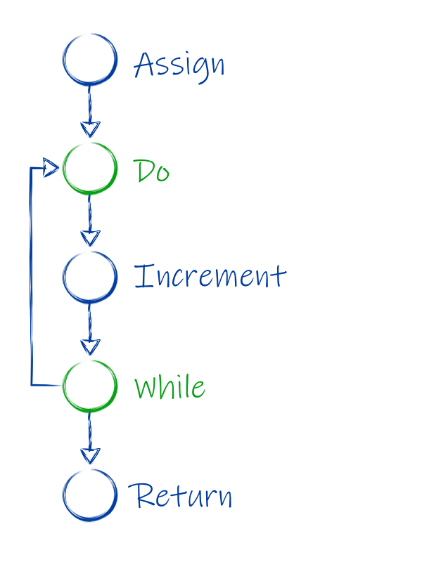
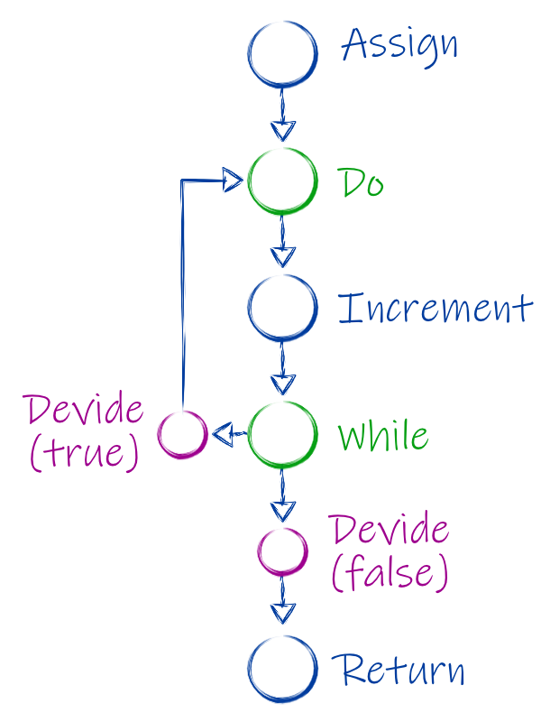

# How it Works

Just to be sure if we talk about `D6` that means a six sided dice with numbered
sides from 1 to 6. A `D20` is a 20 sided dice with numbers from 1 to 20. And so
on...

A [sample space](https://en.wikipedia.org/wiki/Sample_space) is a set of all
possible outcomes.

A dice sequence is a sequence of roles. A sequence is written down as a list of the rolled numbers in braces.
E.g. (1 3 2) for the sequence of 3 roles, the first dice 1 the second 3 and the third 2.

A terminated dice sequence is a sequence of roles that lead to one outcome in the sample
space. Multiple terminated dice sequences may result in the same outcome.

# Basics

Lets look at a simple sample. 

> Role a D6 if you role a 6 you may role once more and add the second role to
> your first.

You can draw a diagram to visualize how the probability's are distributed:


The Probability is written in the braces, before that is the rolled value. In
the next line is the result.

As you can see the the values from 1 - 5 have a probability of 1/6. The values
from 7 - 12 have a probability of 1/36. To get the probability of the 3 you just
need to divide one by the number of faces of the dice.

To get the probability of the 8, you first need to role a 6, as we've already
know that has a probability of 1/6. We then need to role a 2. The probability
for that is 1 / 6 (for the first 6) / 6 (for the followed 2) = 1/36.

From now on we will write down how we role using pseudo code. The example above
would be:
```
var role: int = D6
if role == 6
    role = role + D6

return role
```

First we role a 6 sided dice and store its value in the variable `role`. We then
check if the in `role` stored value is a 6. Then and only then we role a second
dice sum it together with the stored value and overwrite the value in `role`. At
the end we return the value in `role`.

# Simple solution

If we want to know all possible outcomes and there distribution, the first
approach one might try is to just test every possible combination of roles and
note the outcomes. This is actually how the first version of this project had
done it.

But if your roles become more complex and the number of dices increases we will
soon have to many calculations to finish them in an reasonable amount of time.

In addition there may be infinite possibility's we need to know when to stop and
in which order to test.

Let us change one detail from the first example. We may now role again every
time we role a 6 not only the first.

```
# The current role
var role: int 
# The sume of all roles
var sum: int
do {
    role = D6
    sume = sum + role
} while role == 6

return sum
```


Now we have an infinite amount of dices that may be rolled. If we try to search
the sample space deterministic always starting with the highest number of
an dice, we would never finish the first role.

To mitigate that we could say to choose the rolled side randomly and make sure to
never take the same choice again.

Such a list can look like following:

* 3 => 1/6
* 6,4 => 1/36
* 6,3 => 1/36
* 5 => 1/6
* 6,6,1 => 1/216
* ...

This may have another problem, while it is unlikely we may never role a 1 in the
first role. meaning we miss 1/6 of out sample space. 

We also need to search extensively until we have searched all or at least most
of the sample space. To illustrate this we look at the following sample. It will
calculate how long a fight will take. We try to attack and if we hit we reduce
the life by D6.

```
var attack:int = 14
var life: int = 30
var rounds: int = 0

do {
    round = round + 1
    if D20 <= attack
        life = life - D6
} while life > 0

return rounds
```

We try to approximate the number of dice sequences.

We start with all sequences that exist in the first round.

First the number of sequences if we miss. (15) (16) (17) (18) (19) and (20) in
total 4 sequences. In addition we have the sequence where we hit. (1 1) (1 2)
... (1 6) (2 1) ... (2 6) ... (14 6) I hope you don't mind that I haven't
written all combinations down, there are 84. Together with the missed we have 88
sequences for the first round.

In the second round we have the same number of sequences, that means for every
sequence of the first round we have an additional 88 sequences resulting in a
total of 7744 sequences. Some example of those 7744 sequences are (16 15) (18 3
4) (2 4 18) (2 1 10 3). The minimum number of rounds is 5 if we hit every round
and role a 6 for dame we will have accumulated 30 damage. Or reduced the life to
zero. The amount of sequences we need to compute for 5 rounds is 88^5=
5,277,319,168.


# Solution in this project

We try to reduce the amount of computation by calculating intermediate results
and reduce those.

If we role 2D6 we have 36 possible dice sequences. But if we are only
interested in the sum of those 2 roles we reduce this to 11 outcomes (2 - 12).

```
var r1: int = D6
var r2: int = D6
var sum: int = r1 + r2
return sum
```
## The Variable tables

Instead of trying every combination of roles, we create a table for every
variable. This table contains the possible values the variable might have and
there probability's.

If we look at line 1, we crate one table it has two columns one column named r1
that contains the values r1 may have and a second column P that contains the
probability for the row.

r1|p
-|-
1|1/6
2|1/6
3|1/6
4|1/6
5|1/6
6|1/6

In line 2 we create a second table for r2.

r2|p
-|-
1|1/6
2|1/6
3|1/6
4|1/6
5|1/6
6|1/6

Those two tables are unrelated for now so we have two tables with both 6 values.

In line 3 we will now combine those two tables since the new variable sum is
depended on both tables. Instead of creating a third table we combine the
previous two tables resulting in one table that has the columns r1, r2, sum and
p

r1|r2|sum|p
-|-|-|-
1|1|2|1/36
2|1|3|1/36
3|1|4|1/36
4|1|5|1/36
5|1|6|1/36
6|1|7|1/36
1|2|3|1/36
2|2|4|1/36
3|2|5|1/36
4|2|6|1/36
5|2|7|1/36
6|2|8|1/36
1|3|4|1/36
2|3|5|1/36
3|3|6|1/36
4|3|7|1/36
5|3|8|1/36
6|3|9|1/36
1|4|5|1/36
2|4|6|1/36
3|4|7|1/36
4|4|8|1/36
5|4|9|1/36
6|4|10|1/36
1|5|6|1/36
2|5|7|1/36
3|5|8|1/36
4|5|9|1/36
5|5|10|1/36
6|5|11|1/36
1|6|7|1/36
2|6|8|1/36
3|6|9|1/36
4|6|10|1/36
5|6|11|1/36
6|6|12|1/36

In line 4 we now return the values for sum we can now return every outcome for
sum together with its probability.

## Optimizing Tables

But so fare we are not really better then version one. It doesn't matter if we try every possible combination or if we need to calculate every row.

To optimize our tables we need to know what variables we actually need. For that we start from the bottom, our return statement and for every line note what variables we actually need.

Line 4 needs the variable `sum`. Line 3 creates `sum` and uses for that `r1` and `r2`. So  line 3 needs `r1` and `r2`. Since it creates `sum` itself it no longer need the variable `sum`. Line 2 creates `r2` so it will no longer need it but since it does not provide `r1` it still requires `r1`. Line one does not require any variable.

line number | provides | require
-|-|-
1|`r1`| ∅
2|`r2`| `r1`
3|`sum`| `r1` `r2`
4| ∅ | `sum`

To optimize a table we can look at what the next line requires and remove the
columns in the table not required by the next line.

In our example, since line 4 does not require `r1` and `r2` we can delete those columns from our table.

sum|p
-|-
2|1/36
3|1/36
4|1/36
5|1/36
6|1/36
7|1/36
3|1/36
4|1/36
5|1/36
6|1/36
7|1/36
8|1/36
4|1/36
5|1/36
6|1/36
7|1/36
8|1/36
9|1/36
5|1/36
6|1/36
7|1/36
8|1/36
9|1/36
10|1/36
6|1/36
7|1/36
8|1/36
9|1/36
10|1/36
11|1/36
7|1/36
8|1/36
9|1/36
10|1/36
11|1/36
12|1/36

After deleting the columns we can group rows together that are identical (two rows are identical iv every entry in it is the same as in the other ignore the p column for that purpose) the p value is the sum of the grouped p values.

in our example this reduces the number of rows to 11.

sum | p
-|-
2| 1/36
3| 2/36
4| 3/36
5| 4/36
6| 5/36
7| 5/36
8| 5/36
9| 4/36
10| 3/36
11| 2/36
12| 1/36

Of course we need to calculate every of the 36 rows in order to calculate the sum of p. 
The advantage will be visible if we extend the sample with a third role

```
var r1: int = D6
var r2: int = D6
var r3: int = D6
var sum1: int = r1 + r2
var sum2: int = sum1 + r3
return sum2
```

The tables of `r1` `r2` `r3` start with 6 rows each. Combining `r1` and `r2` to
calculate `sum1` will create a table with 36 entry's. Before we combine `sum1` with `r3` we can optimize the table and reduce the number of rows to 11. So we only need to calculate 66 rows (6 * 11) instead of 216 ( 36 * 6).


Since we backtrack from the result to find the variables we need, we also eliminate dead variables.

```
var noLongerUsed: int D1000
var r1: int = D6
var r2: int = D6
var sum: int = r1 + r2
return sum
```

In this sample the first variable does not increase the complexity. Since Line 2 does not require `noLongerUsed` its table can be ignored.

## States

The program is represent with states every operation results in one state. Each
state knows its parent. A state can have a table which contains variables. If we
need to know the values of an variable we can ask a state. It will look up the
value of the variable in its own table, if it's table does not contain the
searched variable it asks its parent.

```
var r1: int = D6
var r2: int = D6
var sum: int = r1 + r2
return sum
```

The sample above creates one state per line. With the exceptions of line 3 that
has two states. The assign operation gives an variable a name which its own state
and the + operation creates an anonym variable which stores the result of the
operation and is the other state.

state 1 in line one has a table with the value of `r1`. state 2 in Line 2 has a
table with `r2`. state 3 in line 3, the addition has a table that contains also
`r1` and `r2` in addition to the anonymous variable that is the sum of both. For
convenient reasons we call that variable `Z`. state 4, also line 3 assigns
variable `Z` to the named variable `sum`. It contains a table with the values of
`sum` since neither of the variables `r1`, `r2` and `z` will be needed after
this state. The last line is the return state and does not have a table.

The next step is to tell every state which variables the following states will
need, as described in the last section. After that we optimize the tables, we
start with the first state and calculate/create the table. After that we remove
all columns that we no longer need and reduce the table rows.

If we now want to calculate the result, we ask the root state for it. The root
state does not know the result so it asks its parent state, state 4 the
assignment, for the value of sum. Since state 4 did know it needed the `sum` its
table retained a column containing the variable and it can be returned.

# Loop

A loop is represented by two states a do state that marks the beginning and a
while state that has a condition and marks the end.

The do state is a special state since it has 2 parents. The state that was
created right before it like every other state and its corresponding while state
as a second.

To prevent that we will never get a result if we have an infinite loop, we
calculate the results multiple times. increasing the number of times we take the
loop by one. The first time we calculate the result under the assumption we only
visit the loop once. The second calculation will visit the loop exactly twice.

```
var sum: int = D3
do {
    sum = sum +1
} while D6 >4
return sum
```



Looking at this example, we visit the statements in the first run in following order:

1. Assign
2. Do
3. Increment
4. While
5. Return

In the second run we will visit the loop two times visiting the increment multiple times. The order looks like this:

1. Assign
2. Do
3. Increment
4. While
5. Do
6. Increment
7. While
8. Return

The third time we will visit the loop 3 times and so on.

Up until now all tables had a total `p` of 1. But when we run the first time, we
did not get all possible solutions, we only get the probability's of solutions
that visit the loop exactly one time.

To compensate this we assign every state an additional probability. This
describes the chance that this state will actually be visited. When we evaluate
the result we will multiply the probability of each entry in the table with its
state probability.

Be aware, if we visit a state multiple times its values have changed. This is
true for the just described state probability as well as the tables describing
the probability of the variables.

To make things easier we add two new states after the while. We call those
divide states. One is the true state the other is the false state.



The first state, the root state, has a probability 1. Each other state has the
probability of its parent. The exception are the divide states.

A dived state is depended up on a variable. In our example it is the condition
in our while, `D6 > 4`. The state probability is the probability that the
variable will be `true` for the `divide (true)` (1/3) state and `false` for the
`divide (false)` (2/3) state.

Lets look at the example again, when we iterate the loop once:

1. Assign  
   State P = 1
   sum| p
   -|--
   1|1/3
   2|1/3
   3|1/3
2. Do  
   State P = 1
3. Increment  
   State P = 1
   sum| p
   -|--
   2|1/3
   3|1/3
   4|1/3

4. While  
   State P = 1
5. Divide (false)  
   State P = 2/3

6. Return
   State P = 2/3

The results of the first run are 

sum|p
-|-
2|2/9
3|2/9
4|2/9

Now when we iterate the loop two times:

1. Assign  
   State P = 1
   sum| p
   -|--
   1|1/3
   2|1/3
   3|1/3
2. Do  
   State P = 1
3. Increment  
   State P = 1
   sum| p
   -|--
   2|1/3
   3|1/3
   4|1/3

4. While  
   State P = 1
5. Divide (true)  
   State P = 1/3

6. Do
   State P = 1/3
7. Increment
   State P = 1/3
   sum| p
   -|--
   3|1/3
   4|1/3
   5|1/3
8. While
9. Divide (false)  
   State P = 2/9 (`1/3 * 2/3`)
10. Return  
    State P = 2/9


The results of the second run are 

sum|p
-|-
3|2/27
4|2/27
5|2/27

Combined with the first run we get:

sum|p
-|-
2|6/27
3|8/27
4|8/27
5|2/27

And have visit 5/9 of the sample space. We will never be able to search the
complete sample space (in this example), but we we can stop if we searched enough, e.g. 99,99% of
it.

You may have noticed, the first part of both runs is identical up to state 4.
This allows us to further optimize, we can cache the tables and state
probability's we have calculated and don't need to to compute them again. The third and second run will be identical up to state 8.

So in our example, for each run, we always need only to compute the last 6
statements. Which is a linear time `O(n)`. However, this is only true for our
sample since the tables do not increase. If with every loop your tables get
bigger, the computation time needed will increase with every loop, so that we
will no longer have linear time.

This also works with multiple loops we just need to ensure we can iterate all
possible combinations of loops.

To archive that we use a bit vector. Each time we hit a divide state we store
our choice. 1, we take the true path, 0 we take the false path. In our example
the runs have following vectors:

run#|vector
-|-
1|0
2|10
3|110
4|1110

You probably noticed that we don't use all possible permutations of the bit
filed. Since as soon we have a zero the program reaches return. So every vector
for this program has exactly one zero and it is the last bit in the vector.

```
var sum: int = D3
do {
    sum = sum + 1
} while D6 >4
do {
    sum = sum - 1
} while D6 >4
return sum
```

If we have two while loops like in the updated sample above, we will always have exactly 2 zeros, and one is in the last bit.

```
var sum: int = D3
do {
  sum = sum + 1
  do {
    sum = sum - 1
  } while D6 >4
} while D6 >4
return sum
```
If we have one loop in another, the vector can have multiple zeros, but not two
zeros in a row. Unless its the last two bits, which are always zero.

The bit vector describes actually a path through a binary tree. 

# Branches

We can handle branches or if statements the same way we handle while. On 
one run we take the true case on the next the false case.

However using if statements should be avoided if possible, since they are not
very performant. There is an more performant alternative for most cases, the
[switch](dice-language.md#switch) which is some kind of conditional assignment.

But back to branches and why the if is not very performant. After all it uses
the same machinic as loops and there was no warning.

The problem with if manifest itself if you have many if's. Every if will double
the number of runs needed to get the result. Even simple code can have multiple
if's. Unlike while's, most code will often have only one while maybe two. 

The problem starts actually if we put multiple ifs inside a while loop that will
execute several times. This increases the number of if's executed which let the
necessary runs skyrocket.

We can use a sample again to show what the problem is. This will give you
hopefully an hint when it is ok to use if and when you should try to avoid them.

The language documentation has a little example that has 7 if statements inside
a while loop. If we run the loop once we actually need multiple runs to visit
all execution paths of the if's. We will need actually 128 (`2^7`). This sounds
much, but your Computer is probably fast enough to calculate all runs for the
first loop pretty quickly.

However if we look at the second loop we need to combine every run of the first
loop with all 128 possible executions paths we can take through the if's. This means 128 times 128. So our second loop needs 16,384 runs.

loop|runs needed
-|-
1| 128
2| 16,384
3|2,097,152
4|268,435,456
5|34,359,738,368

Compared to one run per loop if you have no if statements, it should be easy to see why this gets out of hand quickly.
